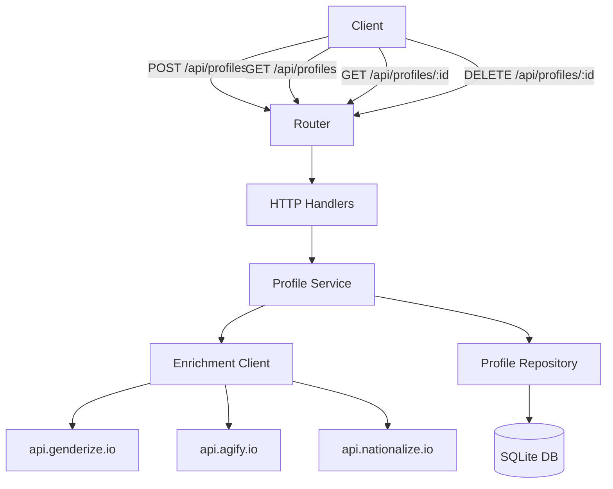
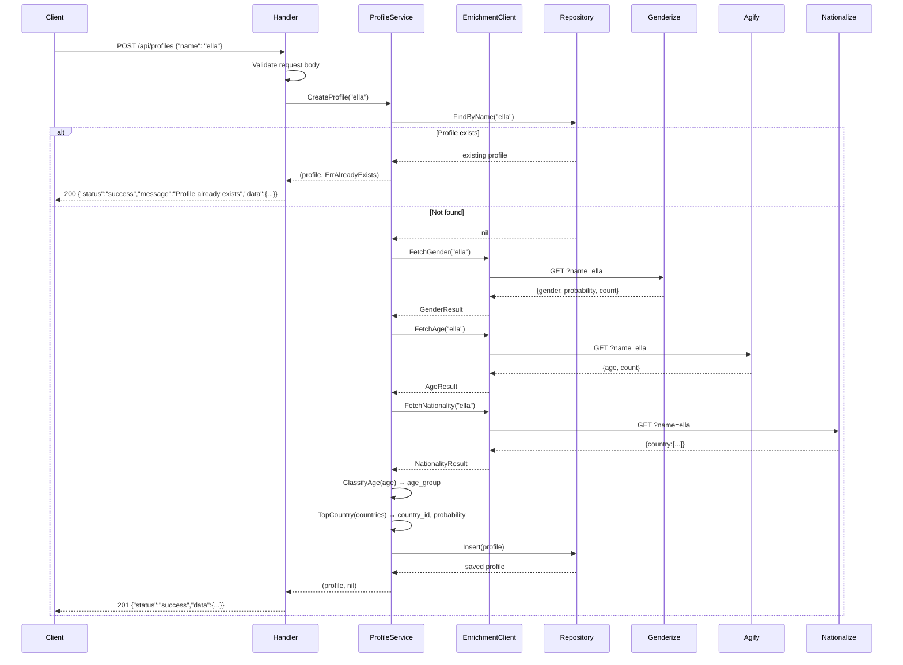
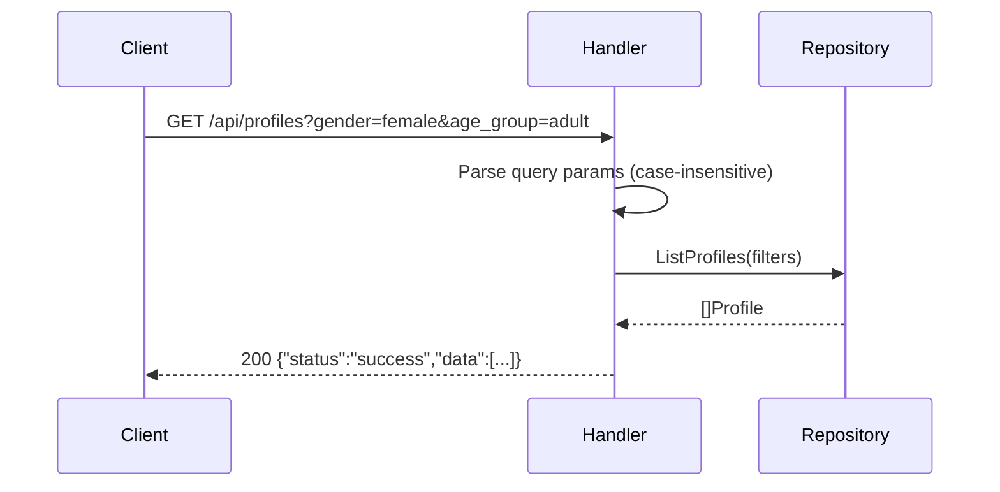

# Design Document: Name Profile API

## Overview

A Go REST API service that accepts a name, enriches it by calling three external APIs (Genderize, Agify, Nationalize), applies classification logic, persists the result in SQLite, and exposes CRUD endpoints. The service is idempotent on name — submitting the same name twice returns the existing profile rather than creating a duplicate.

The service is structured as a standard Go project with clear separation between HTTP handlers, service logic, external API clients, and database access. All IDs are UUID v7, all timestamps are UTC ISO 8601, and CORS is open (`Access-Control-Allow-Origin: *`).

## Architecture



## Sequence Diagrams

### POST /api/profiles — Create Profile



### GET /api/profiles — List with Filters



## Components and Interfaces

### Handler Layer (`internal/handler`)

**Purpose**: Parse HTTP requests, validate input, delegate to service, format responses.

**Interface**:
```go
type ProfileHandler struct {
    service ProfileService
}

func NewProfileHandler(service ProfileService) *ProfileHandler

func (h *ProfileHandler) CreateProfile(w http.ResponseWriter, r *http.Request)
func (h *ProfileHandler) GetProfile(w http.ResponseWriter, r *http.Request)
func (h *ProfileHandler) ListProfiles(w http.ResponseWriter, r *http.Request)
func (h *ProfileHandler) DeleteProfile(w http.ResponseWriter, r *http.Request)
```

**Responsibilities**:
- Decode and validate JSON request bodies
- Extract path parameters and query parameters
- Map service errors to HTTP status codes
- Write JSON responses with correct status codes
- Apply CORS header on every response

### Service Layer (`internal/service`)

**Purpose**: Orchestrate enrichment, apply business logic, coordinate persistence.

**Interface**:
```go
type ProfileService interface {
    CreateProfile(ctx context.Context, name string) (*Profile, error)
    GetProfile(ctx context.Context, id string) (*Profile, error)
    ListProfiles(ctx context.Context, filters ProfileFilters) ([]Profile, error)
    DeleteProfile(ctx context.Context, id string) error
}

type ProfileFilters struct {
    Gender   string // optional, case-insensitive
    CountryID string // optional, case-insensitive
    AgeGroup  string // optional, case-insensitive
}
```

**Responsibilities**:
- Check for existing profile by name (idempotency)
- Call enrichment client for gender, age, nationality
- Apply age classification and top-country selection
- Generate UUID v7 and timestamps
- Delegate persistence to repository

### Enrichment Client (`internal/enrichment`)

**Purpose**: Call the three external APIs and return typed results.

**Interface**:
```go
type EnrichmentClient interface {
    FetchGender(ctx context.Context, name string) (*GenderResult, error)
    FetchAge(ctx context.Context, name string) (*AgeResult, error)
    FetchNationality(ctx context.Context, name string) (*NationalityResult, error)
}

type GenderResult struct {
    Gender      string
    Probability float64
    Count       int
}

type AgeResult struct {
    Age   int
    Count int
}

type NationalityResult struct {
    CountryID   string
    Probability float64
}
```

**Responsibilities**:
- Make HTTP GET requests to external APIs
- Decode JSON responses
- Return typed errors for null/invalid data (502 upstream)
- Respect context cancellation/timeout

### Repository Layer (`internal/repository`)

**Purpose**: Persist and query profiles in SQLite.

**Interface**:
```go
type ProfileRepository interface {
    Insert(ctx context.Context, p *Profile) error
    FindByID(ctx context.Context, id string) (*Profile, error)
    FindByName(ctx context.Context, name string) (*Profile, error)
    List(ctx context.Context, filters ProfileFilters) ([]Profile, error)
    Delete(ctx context.Context, id string) error
}
```

**Responsibilities**:
- Execute parameterized SQL queries
- Map rows to `Profile` structs
- Return `ErrNotFound` when no row matches

## Data Models

### Profile

```go
type Profile struct {
    ID                 string    `json:"id"`
    Name               string    `json:"name"`
    Gender             string    `json:"gender"`
    GenderProbability  float64   `json:"gender_probability"`
    SampleSize         int       `json:"sample_size"`
    Age                int       `json:"age"`
    AgeGroup           string    `json:"age_group"`
    CountryID          string    `json:"country_id"`
    CountryProbability float64   `json:"country_probability"`
    CreatedAt          time.Time `json:"created_at"`
}
```

**Validation Rules**:
- `name` must be a non-empty string
- `id` is UUID v7, generated server-side
- `created_at` stored and returned as UTC ISO 8601
- `age_group` is one of: `child`, `teenager`, `adult`, `senior`

### Request / Response Types

```go
type CreateProfileRequest struct {
    Name string `json:"name"`
}

type APIResponse struct {
    Status  string      `json:"status"`
    Message string      `json:"message,omitempty"`
    Data    interface{} `json:"data,omitempty"`
}

type ErrorResponse struct {
    Status  string `json:"status"`
    Message string `json:"message"`
}
```

### SQLite Schema

```sql
CREATE TABLE IF NOT EXISTS profiles (
    id                  TEXT PRIMARY KEY,
    name                TEXT NOT NULL UNIQUE,
    gender              TEXT NOT NULL,
    gender_probability  REAL NOT NULL,
    sample_size         INTEGER NOT NULL,
    age                 INTEGER NOT NULL,
    age_group           TEXT NOT NULL,
    country_id          TEXT NOT NULL,
    country_probability REAL NOT NULL,
    created_at          TEXT NOT NULL
);

CREATE INDEX IF NOT EXISTS idx_profiles_name ON profiles(name);
CREATE INDEX IF NOT EXISTS idx_profiles_gender ON profiles(LOWER(gender));
CREATE INDEX IF NOT EXISTS idx_profiles_country_id ON profiles(LOWER(country_id));
CREATE INDEX IF NOT EXISTS idx_profiles_age_group ON profiles(LOWER(age_group));
```

## Key Functions with Formal Specifications

### ClassifyAge

```go
func ClassifyAge(age int) string
```

**Preconditions:**
- `age >= 0`

**Postconditions:**
- Returns exactly one of: `"child"`, `"teenager"`, `"adult"`, `"senior"`
- `age in [0,12]`   → `"child"`
- `age in [13,19]`  → `"teenager"`
- `age in [20,59]`  → `"adult"`
- `age >= 60`       → `"senior"`

**Loop Invariants:** N/A (pure conditional)

### TopCountry

```go
func TopCountry(countries []CountryEntry) (countryID string, probability float64, err error)
```

**Preconditions:**
- `countries` is not nil

**Postconditions:**
- If `len(countries) == 0` → returns `ErrNoCountryData`
- Otherwise returns the entry with the highest `Probability`
- Ties broken by first occurrence

**Loop Invariants:**
- After each iteration, `best` holds the entry with the highest probability seen so far

### ValidateName

```go
func ValidateName(name string) error
```

**Preconditions:** none

**Postconditions:**
- Returns `ErrMissingName` if `strings.TrimSpace(name) == ""`
- Returns `nil` otherwise

## Algorithmic Pseudocode

### CreateProfile Algorithm

```go
func (s *profileService) CreateProfile(ctx context.Context, name string) (*Profile, error) {
    // Precondition: name is non-empty (validated by handler)

    // Step 1: Idempotency check
    existing, err := s.repo.FindByName(ctx, name)
    if err == nil {
        return existing, ErrAlreadyExists
    }
    if !errors.Is(err, ErrNotFound) {
        return nil, err
    }

    // Step 2: Enrich — all three calls must succeed
    genderResult, err := s.enrichment.FetchGender(ctx, name)
    if err != nil {
        return nil, err // wraps ErrUpstream with source name
    }

    ageResult, err := s.enrichment.FetchAge(ctx, name)
    if err != nil {
        return nil, err
    }

    nationalityResult, err := s.enrichment.FetchNationality(ctx, name)
    if err != nil {
        return nil, err
    }

    // Step 3: Classify
    ageGroup := ClassifyAge(ageResult.Age)

    // Step 4: Build and persist profile
    profile := &Profile{
        ID:                 newUUIDv7(),
        Name:               name,
        Gender:             genderResult.Gender,
        GenderProbability:  genderResult.Probability,
        SampleSize:         genderResult.Count,
        Age:                ageResult.Age,
        AgeGroup:           ageGroup,
        CountryID:          nationalityResult.CountryID,
        CountryProbability: nationalityResult.Probability,
        CreatedAt:          time.Now().UTC(),
    }

    if err := s.repo.Insert(ctx, profile); err != nil {
        return nil, err
    }

    // Postcondition: profile stored with valid UUID v7 and UTC timestamp
    return profile, nil
}
```

### FetchGender Algorithm

```go
func (c *httpEnrichmentClient) FetchGender(ctx context.Context, name string) (*GenderResult, error) {
    // Precondition: name is non-empty

    resp, err := c.httpClient.Get(ctx, "https://api.genderize.io?name="+url.QueryEscape(name))
    if err != nil {
        return nil, fmt.Errorf("Genderize returned an invalid response")
    }
    defer resp.Body.Close()

    var payload struct {
        Gender      *string  `json:"gender"`
        Probability float64  `json:"probability"`
        Count       int      `json:"count"`
    }
    if err := json.NewDecoder(resp.Body).Decode(&payload); err != nil {
        return nil, fmt.Errorf("Genderize returned an invalid response")
    }

    // Postcondition: gender must be non-null and count > 0
    if payload.Gender == nil || payload.Count == 0 {
        return nil, &UpstreamError{Source: "Genderize"}
    }

    return &GenderResult{
        Gender:      *payload.Gender,
        Probability: payload.Probability,
        Count:       payload.Count,
    }, nil
}
```

### ListProfiles Algorithm

```go
func (r *sqliteRepo) List(ctx context.Context, filters ProfileFilters) ([]Profile, error) {
    // Build query dynamically; all filter comparisons are LOWER(col) = LOWER(?)
    query := "SELECT * FROM profiles WHERE 1=1"
    args := []interface{}{}

    if filters.Gender != "" {
        query += " AND LOWER(gender) = LOWER(?)"
        args = append(args, filters.Gender)
    }
    if filters.CountryID != "" {
        query += " AND LOWER(country_id) = LOWER(?)"
        args = append(args, filters.CountryID)
    }
    if filters.AgeGroup != "" {
        query += " AND LOWER(age_group) = LOWER(?)"
        args = append(args, filters.AgeGroup)
    }

    rows, err := r.db.QueryContext(ctx, query, args...)
    // ... scan rows into []Profile
    return profiles, err
}
```

## Error Handling

### Error Types

```go
var (
    ErrNotFound     = errors.New("profile not found")
    ErrAlreadyExists = errors.New("profile already exists")
    ErrMissingName  = errors.New("name is required")
)

type UpstreamError struct {
    Source string // "Genderize" | "Agify" | "Nationalize"
}

func (e *UpstreamError) Error() string {
    return e.Source + " returned an invalid response"
}
```

### HTTP Error Mapping

| Error | HTTP Status | Response message |
|---|---|---|
| `ErrMissingName` | 400 | `"name is required"` |
| Invalid JSON / wrong type | 422 | `"invalid request body"` |
| `ErrNotFound` | 404 | `"profile not found"` |
| `ErrAlreadyExists` | 200 | `"Profile already exists"` (returns data) |
| `*UpstreamError` | 502 | `"<Source> returned an invalid response"` |
| Other internal errors | 500 | `"internal server error"` |

### Error Scenario: External API Returns Null

**Condition**: Genderize returns `gender: null` or `count: 0`; Agify returns `age: null`; Nationalize returns empty country array.
**Response**: 502 with `{"status":"error","message":"<Source> returned an invalid response"}`
**Recovery**: Profile is NOT stored; client may retry with a different name.

## Testing Strategy

### Unit Testing Approach

Test each layer in isolation using interfaces and mock implementations:
- `ClassifyAge`: table-driven tests covering all boundary values (0, 12, 13, 19, 20, 59, 60, 100)
- `TopCountry`: empty slice, single entry, multiple entries with tie
- `ValidateName`: empty string, whitespace-only, valid name
- Handler tests: use `httptest.NewRecorder` and mock service
- Service tests: mock enrichment client and repository

### Property-Based Testing Approach

**Property Test Library**: `pgregory.net/rapid`

Properties to verify:
- `∀ age ≥ 0: ClassifyAge(age) ∈ {"child","teenager","adult","senior"}`
- `∀ age ∈ [0,12]: ClassifyAge(age) == "child"`
- `∀ age ∈ [13,19]: ClassifyAge(age) == "teenager"`
- `∀ age ∈ [20,59]: ClassifyAge(age) == "adult"`
- `∀ age ≥ 60: ClassifyAge(age) == "senior"`
- `∀ non-empty countries: TopCountry(countries).probability == max(c.probability for c in countries)`

### Integration Testing Approach

- Use `net/http/httptest` to spin up the full router
- Mock external HTTP calls using `net/http` transport replacement
- Test full create → get → list → delete lifecycle
- Test idempotency: two POSTs with same name return same profile ID

## Performance Considerations

- SQLite with WAL mode for concurrent reads
- HTTP client with configurable timeout (default 5s per external API call)
- Context propagation throughout for cancellation support
- Indexes on `name`, `gender`, `country_id`, `age_group` for filter queries

## Security Considerations

- All SQL queries use parameterized statements (no string interpolation)
- Input name is URL-encoded before appending to external API URLs
- No authentication required per spec; CORS is open (`*`)
- External API responses are decoded into typed structs (no `interface{}` passthrough)

## Project Layout

```
name-profile-api/
├── main.go                        # Entry point, wires dependencies
├── go.mod
├── go.sum
├── internal/
│   ├── handler/
│   │   └── profile.go             # HTTP handlers
│   ├── service/
│   │   ├── profile.go             # Business logic
│   │   └── classify.go            # ClassifyAge, TopCountry
│   ├── enrichment/
│   │   └── client.go              # External API calls
│   ├── repository/
│   │   └── sqlite.go              # SQLite persistence
│   └── model/
│       └── profile.go             # Shared types
└── db/
    └── schema.sql                 # SQLite schema
```

## Dependencies

| Package | Purpose |
|---|---|
| `github.com/google/uuid` | UUID v7 generation |
| `github.com/mattn/go-sqlite3` | SQLite driver (CGO) |
| `github.com/go-chi/chi/v5` | HTTP router with path params |
| `pgregory.net/rapid` | Property-based testing |
| Standard library only for everything else | |

## Correctness Properties

*A property is a characteristic or behavior that should hold true across all valid executions of a system — essentially, a formal statement about what the system should do. Properties serve as the bridge between human-readable specifications and machine-verifiable correctness guarantees.*

### Property 1: ClassifyAge covers all non-negative ages with correct labels

*For any* non-negative integer `age`, `ClassifyAge(age)` shall return exactly one of `"child"`, `"teenager"`, `"adult"`, or `"senior"`, and the returned label shall match the correct range: `[0,12]` → `"child"`, `[13,19]` → `"teenager"`, `[20,59]` → `"adult"`, `≥60` → `"senior"`.

**Validates: Requirements 3.1, 3.2, 3.3, 3.4, 3.5**

---

### Property 2: TopCountry returns the maximum-probability entry

*For any* non-empty slice of `CountryEntry` values, `TopCountry` shall return the entry whose `Probability` is greater than or equal to the `Probability` of every other entry in the slice.

**Validates: Requirements 4.1, 4.2**

---

### Property 3: ValidateName rejects exactly the whitespace-only inputs

*For any* string `s`, `ValidateName(s)` shall return `ErrMissingName` if and only if `strings.TrimSpace(s)` is the empty string; for all other strings it shall return `nil`.

**Validates: Requirements 1.2, 1.5**

---

### Property 4: Upstream errors never result in a stored profile

*For any* name and any configuration where at least one enrichment call (Genderize, Agify, or Nationalize) returns an `UpstreamError`, the Profile_Service shall not insert a record into the Profile_Repository, and the Profile_Handler shall return HTTP 502.

**Validates: Requirements 5.4, 5.5, 5.6, 5.7**

---

### Property 5: List filter correctness — all filters applied conjunctively

*For any* set of profiles in the repository and any combination of `gender`, `country_id`, and `age_group` filter values, every profile returned by `ListProfiles` shall satisfy all supplied filters case-insensitively, and no profile that satisfies all filters shall be omitted from the result.

**Validates: Requirements 7.2, 7.3, 7.4, 7.5**

---

### Property 6: Delete makes a profile permanently unretrievable

*For any* profile that exists in the repository, after `DeleteProfile` is called with its `id`, any subsequent call to `GetProfile` with the same `id` shall return `ErrNotFound`.

**Validates: Requirements 8.3**

---

### Property 7: Profile creation idempotency

*For any* name, calling `CreateProfile` twice with the same name shall result in exactly one record in the Profile_Repository for that name, and both calls shall return a profile with the same `id`.

**Validates: Requirements 11.1, 11.2**

---

### Property 8: Profile JSON round-trip

*For any* valid `Profile` struct, marshalling it to JSON and then unmarshalling the result shall produce a `Profile` struct whose fields are all equal to the original, including `id`, `name`, `gender`, `gender_probability`, `sample_size`, `age`, `age_group`, `country_id`, `country_probability`, and `created_at`.

**Validates: Requirements 12.1, 12.4**

---

### Property 9: Profile SQLite round-trip

*For any* valid `Profile` struct, inserting it into the SQLite database via `Profile_Repository.Insert` and then retrieving it via `Profile_Repository.FindByID` shall produce a `Profile` struct whose fields are all equal to the original, including the `created_at` timestamp at UTC ISO 8601 precision.

**Validates: Requirements 12.2, 12.3**

---

### Property 10: Every response carries the CORS header

*For any* HTTP request to any endpoint (`POST /api/profiles`, `GET /api/profiles`, `GET /api/profiles/{id}`, `DELETE /api/profiles/{id}`), the response shall include the header `Access-Control-Allow-Origin: *` regardless of the outcome (success or error).

**Validates: Requirements 10.1**

---

### Property 11: Created profiles have valid UUID v7 ids and UTC ISO 8601 timestamps

*For any* successful `CreateProfile` call, the returned profile's `id` shall be a valid UUID v7 string and `created_at` shall be a valid UTC ISO 8601 timestamp string.

**Validates: Requirements 9.2, 9.3, 2.3**
